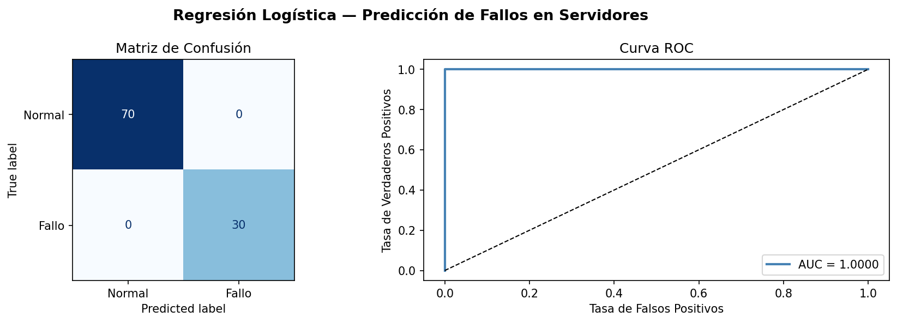

# Prediccion de Fallos en Servidores
### Metodo: Regresion Logistica

**Materia:** Metodos Numericos  
**Universidad:** Universidad San Francisco Xavier de Chuquisaca  

---

## Descripcion

Sistema de prediccion que determina si un servidor esta a punto de fallar usando cuatro variables de monitoreo en tiempo real. El modelo aplica **Regresion Logistica** para clasificar el estado del servidor en dos categorias: **Normal** o **Fallo inminente**.

---

## Variables de entrada

| Variable | Descripcion | Rango normal |
|---|---|---|
| `temperatura_cpu` | Temperatura del procesador en grados Celsius | 30 — 75 C |
| `uso_cpu` | Porcentaje de uso del procesador | 5 — 70 % |
| `uso_ram` | Porcentaje de uso de memoria RAM | 10 — 75 % |
| `paquetes_perdidos` | Porcentaje de paquetes de red perdidos | 0 — 10 % |

---

## Fundamento matematico

### Funcion Sigmoide

El modelo convierte la combinacion lineal de variables en una probabilidad usando la funcion sigmoide:

$$\sigma(z) = \frac{1}{1 + e^{-z}}$$

Donde:

$$z = \beta_0 + \beta_1 \cdot x_1 + \beta_2 \cdot x_2 + \beta_3 \cdot x_3 + \beta_4 \cdot x_4$$

### Regla de decision

$$\hat{y} = \begin{cases} 1 & \text{Fallo inminente} \quad \text{si } \sigma(z) \geq 0{,}5 \\ 0 & \text{Normal} \quad \text{si } \sigma(z) < 0{,}5 \end{cases}$$

### Funcion de Costo: Log Loss

$$J(\beta) = -\frac{1}{n} \sum_{i=1}^{n} \left[ y_i \cdot \log(\hat{p}_i) + (1 - y_i) \cdot \log(1 - \hat{p}_i) \right]$$

La funcion Log Loss es convexa, lo que garantiza la existencia de un unico minimo global. Los coeficientes se optimizan mediante el algoritmo **L-BFGS**.

---

## Resultados

| Metrica | Valor |
|---|---|
| Precision | 1,00 |
| Recall | 1,00 |
| F1-score | 1,00 |
| AUC-ROC | 1,0000 |



---

## Coeficientes aprendidos

| Variable | Coeficiente β | Interpretacion |
|---|---|---|
| Intercepto β₀ | — | Valor base del modelo |
| temperatura_cpu | +1,7157 | A mayor temperatura, mayor riesgo |
| uso_cpu | +1,7345 | Variable mas influyente |
| uso_ram | +1,6500 | Contribuye significativamente al riesgo |
| paquetes_perdidos | +1,5800 | Indica problemas de red |

Todos los coeficientes son positivos: cualquier variable que suba aumenta la probabilidad de fallo.

---

## Estructura del proyecto

```
Prediccion-de-Fallos-en-Servidores/
│
├── modelo.py                              # Entrenamiento, evaluacion e inferencia
├── generar_dataset.py                     # Generacion del dataset sintetico
├── dataset_servidores.csv                 # 500 registros (350 normales, 150 fallos)
├── resultados.png                         # Curva ROC y matriz de confusion
└── MetodosNumericos_RegresionLogistica.ipynb  # Notebook completo con visualizaciones
```

---

## Como ejecutar

### Opcion 1 — Google Colab (recomendado)

Abre el notebook directamente en Colab:

[](https://colab.research.google.com/github/riguys123/Prediccion-de-Fallos-en-Servidores-Metodo-Regresion-Logistica/blob/main/MetodosNumericos_RegresionLogistica.ipynb)

### Opcion 2 — Local

```bash
# Instalar dependencias
pip install numpy pandas scikit-learn matplotlib

# Generar el dataset
python generar_dataset.py

# Entrenar y evaluar el modelo
python modelo.py
```

---

## Dependencias

```
numpy
pandas
scikit-learn
matplotlib
ipywidgets
```

---

## Dataset

El dataset fue generado sinteticamente con distribuciones diferenciadas para cada clase:

| Clase | Registros | Temperatura | CPU | RAM | Paquetes perdidos |
|---|---|---|---|---|---|
| Normal (0) | 350 | ~55 C | ~45% | ~50% | ~2% |
| Fallo (1) | 150 | ~82 C | ~88% | ~85% | ~18% |

---

*Metodos Numericos — Universidad San Francisco Xavier de Chuquisaca*
